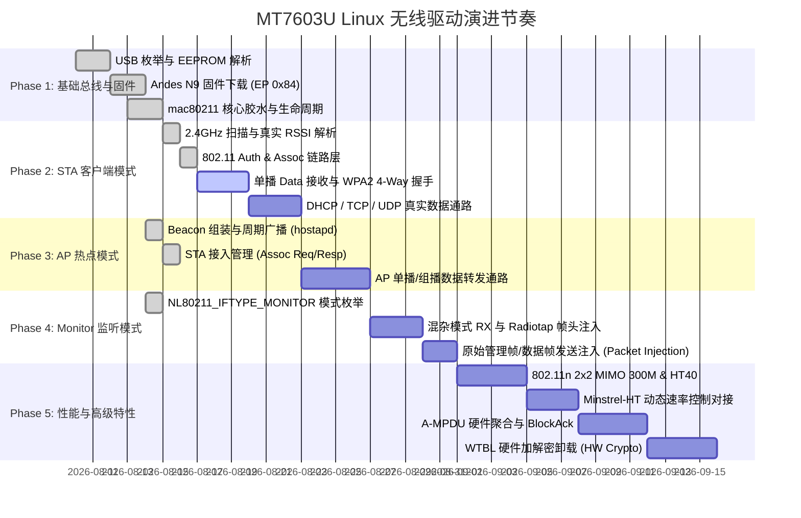

# MT7603U Linux 驱动研发路线图与功能规划矩阵

本文档为 MT7603U Rust + C 混合架构 Linux 无线驱动的核心研发路线图与功能规划清单（Single Source of Truth），明确各阶段里程碑、子功能实现状态、当前遗留问题及对应技术方案/规范索引。

---

## 📅 第一部分：重大功能演进路线图 (Development Roadmap)

### 里程碑节奏定义
- **Milestone 1 (Driver Core Ready)**: 芯片枚举、冷启动固件下载闭环、EEPROM 标定解析、mac80211 设备注册。
- **Milestone 2 (STA Base Flow)**: 主动扫描、周边热点识别与信号强度获取、完成 WPA2-PSK 握手并实现稳定网络通信。
- **Milestone 3 (AP Mode Ready)**: hostapd 热点拉起、多终端同时关联、单播及组播路由转发。
- **Milestone 4 (Monitor & Injection)**: 支持 Wireshark/aircrack-ng 抓包、支持混杂模式与 Radiotap 元数据注入。
- **Milestone 5 (High Throughput 300M)**: 开启 2T2R 双流 40MHz 频宽、A-MPDU 聚合、动态速率自适应。

---

## 📋 第二部分：详细功能规划与状态矩阵 (Feature Planning & Status Matrix)

### 1. 基础驱动与固件子系统 (Base Driver & MCU)

| 子功能 | 状态 | 当前现状与问题 | 方案链接 / 事实依据 |
|---|---|---|---|
| **USB 探测与设备枚举** | ✅ **已支持** | 支持 `0x0E8D:0x760C` 与 `0x0E8D:0x7603`，USB 2.0 High-Speed 枚举。 | [`mac.spec.md`](file:///home/qtopierw/workspace/projects/mt7603u/specs/modules/mac.spec.md) `rtusb_dev_id.c` |
| **EEPROM / eFuse 标定解析** | ✅ **已支持** | 完整读取 1024 字节 eFuse，解析 MAC 地址、TX Power、XTAL Trim、RSSI 校准偏移。 | [`eeprom.spec.md`](file:///home/qtopierw/workspace/projects/mt7603u/specs/modules/eeprom.spec.md) `include/eeprom/mt7603_e2p.h` |
| **Andes N9 固件下载 (冷启动)** | ✅ **已支持** | 冷拔插后首次加载，通过 EP 0x84 ACK 闭环，19 个 scatter 片段 ~25ms 上传完毕。 | [`mcu.spec.md`](file:///home/qtopierw/workspace/projects/mt7603u/specs/modules/mcu.spec.md) `andes_mt.c:AndesMTLoadFwMethod1` |
| **固件热重载 (Restart-DL)** | 🟡 **部分支持** | 模块 rmmod+insmod 重载时向 RAM 固件发 `CmdRestartDLReq`。偶发 MCU 未跳回 ROM (`TOP_MISC2=0x73`) 返回 `-110`，需物理重新拔插兜底。 | [`mcu.spec.md §3`](file:///home/qtopierw/workspace/projects/mt7603u/specs/modules/mcu.spec.md) `andes_mt.c:1009` |
| **UDMA 聚合与端点使能** | ✅ **已支持** | 配置 `UDMA_WLCFG_0` (0x50029018)，使能 EP 0x84 数据环与 EP 0x85 命令响应环。 | [`mac.spec.md SPEC-MAC-001`](file:///home/qtopierw/workspace/projects/mt7603u/specs/modules/mac.spec.md) `cmm_mac_usb.c:RT28XXDMAEnable` |

---

### 2. STA 客户端模式 (Station Mode)

| 子功能 | 状态 | 当前现状与问题 | 方案链接 / 事实依据 |
|---|---|---|---|
| **Probe Request 帧构造** | ✅ **已支持** | Rust 模块生成标准 802.11 Probe Request 探针，通过 EP 0x08 (32B TMAC_TXD_L) 发送。 | [`sta.spec.md SPEC-STA-001`](file:///home/qtopierw/workspace/projects/mt7603u/specs/modules/sta.spec.md) `src/rust/src/sta.rs` |
| **Beacon / Probe Resp 接收** | ✅ **已支持** | EP 0x84 4x24KB 持续接收环正常解包 Beacon 帧，正确解析 BSSID、SSID 及频点。 | [`sta.spec.md SPEC-STA-002`](file:///home/qtopierw/workspace/projects/mt7603u/specs/modules/sta.spec.md) `src/rust/src/rx.rs` |
| **信道 1~13 动态调谐** | ✅ **已支持** | 信道切换时下发 `CmdChannelSwitch` + 写入 `RMAC_CHFREQ=1`，实测扫描出 13 个周边 BSS。 | [`mac.spec.md SPEC-MAC-004`](file:///home/qtopierw/workspace/projects/mt7603u/specs/modules/mac.spec.md) `cmm_asic_mt.c:AsicSwitchChannel` |
| **真实信号强度 (RSSI) 上报** | ✅ **已支持** | 从 Group3 RxVector 提取 `IBRssi0`，结合 eFuse[0x46] 偏移量换算为真实 dBm 上报 mac80211。 | [`rx_tx.spec.md SPEC-RXTX-004`](file:///home/qtopierw/workspace/projects/mt7603u/specs/modules/rx_tx.spec.md) `cmm_sync.c:ConvertToRssi` |
| **802.11 认证与关联 (Auth/Assoc)** | ✅ **已支持** | `wpa_supplicant` 发送 Auth / Assoc Req，接收 AP 返回的 Assoc Resp (status=0)，状态到达 `ASSOCIATED`。 | [`mac80211.c:mt7603_mac80211_tx`](file:///home/qtopierw/workspace/projects/mt7603u/src/c/mac80211.c) `cmm_data_usb.c:RtmpUSBMgmtKickOut` |
| **单播数据帧 (EAPOL) RX 接收** | ❌ **未打通 (当前瓶颈)** | **问题**：关联后 AP 发送单播 EAPOL M1 数据帧，STA 未能成功将单播 Data 帧上报给 mac80211，导致 4-Way 握手超时断开 (`reason=4`)。 **排查方向**：核对关联后 `RMAC_CB0R0/R1` 写入与 `RMAC_RMACDR` 单播放行位。 | [`sta.spec.md §2.6`](file:///home/qtopierw/workspace/projects/mt7603u/specs/modules/sta.spec.md) `cmm_asic_mt.c:AsicSetBssid` |
| **WPA2-PSK 4-Way 握手** | 🟡 **依赖单播 RX** | 握手逻辑由 Linux mac80211 软件处理，依赖单播 EAPOL 帧收发通路闭环。 | [`sta.spec.md §1.1`](file:///home/qtopierw/workspace/projects/mt7603u/specs/modules/sta.spec.md) |
| **DHCP 分配与 IP 数据通路** | 🟡 **依赖握手** | 依赖 4-Way 握手完成后打通 802.11 数据帧（EP 0x05 TX 与 EP 0x84 RX）。 | [`mac80211.c:mt7603_mac80211_tx`](file:///home/qtopierw/workspace/projects/mt7603u/src/c/mac80211.c) |

---

### 3. AP 热点模式 (Access Point Mode)

| 子功能 | 状态 | 当前现状与问题 | 方案链接 / 事实依据 |
|---|---|---|---|
| **NL80211_IFTYPE_AP 枚举** | ✅ **已支持** | `wiphy->interface_modes` 声明 `NL80211_IFTYPE_AP`，支持 `hostapd` 启动。 | [`ap.spec.md`](file:///home/qtopierw/workspace/projects/mt7603u/specs/modules/ap.spec.md) |
| **802.11 Beacon 帧组装与广播** | ✅ **已支持** | Rust 模块生成 Beacon 帧，支持 SSID/Supported Rates/HT Operation IE 构造。 | [`ap.spec.md SPEC-AP-001`](file:///home/qtopierw/workspace/projects/mt7603u/specs/modules/ap.spec.md) `src/rust/src/ap.rs` |
| **STA 客户端接入 (Assoc Req/Resp)** | ✅ **已支持** | Rust 模块提供 `parse_assoc_req` 与 `build_assoc_resp`，支持客户端关联解析与响应。 | [`ap.spec.md SPEC-AP-002/003`](file:///home/qtopierw/workspace/projects/mt7603u/specs/modules/ap.spec.md) `src/rust/src/ap.rs` |
| **AP 客户端接入跟踪 (`sta_add/remove`)** | ✅ **已支持** | 接入 mac80211 `sta_add` 与 `sta_remove` 生命周期回调。 | [`mac80211.c:mt7603_mac80211_sta_add`](file:///home/qtopierw/workspace/projects/mt7603u/src/c/mac80211.c) |
| **AP 单播/多播数据转发** | 🟡 **待验证** | 需在 STA 单播数据通路验证闭环后进行 hostapd 多终端转发实测。 | [`ap.spec.md`](file:///home/qtopierw/workspace/projects/mt7603u/specs/modules/ap.spec.md) |

---

### 4. Monitor 监听与抓包模式 (Monitor Mode)

| 子功能 | 状态 | 当前现状与问题 | 方案链接 / 事实依据 |
|---|---|---|---|
| **NL80211_IFTYPE_MONITOR 声明** | 🟡 **待配置** | 需在 `hw->wiphy->interface_modes` 中增加 `BIT(NL80211_IFTYPE_MONITOR)`。 | [`0001-architecture.md`](file:///home/qtopierw/workspace/projects/mt7603u/docs/rfcs/0001-architecture.md) |
| **RMAC 混杂模式接收 (Promiscuous RX)** | 🟡 **待实现** | 配置 `RMAC_RMACDR` 开启混杂过滤（放行所有 BSSID 与 Control/Management/Data 帧）。 | `include/mac/mac_mt/wf_rmac.h` `cmm_asic_mt.c:AsicSetRxFilter` |
| **Radiotap Header 元数据填充** | 🟡 **待实现** | 将 RxVector 中的频点、速率、RSSI、天线号封装为 Radiotap 格式上报 Wireshark。 | [`rx_tx.spec.md`](file:///home/qtopierw/workspace/projects/mt7603u/specs/modules/rx_tx.spec.md) |
| **原始数据帧注入 (Packet Injection)** | 🟡 **待实现** | 支持无需关联直接从用户态发送原始 802.11 帧（EP 0x08 透传）。 | [`sta.spec.md SPEC-STA-005`](file:///home/qtopierw/workspace/projects/mt7603u/specs/modules/sta.spec.md) |

---

### 5. 吞吐率与物理层性能优化 (High Throughput & Advanced PHY)

| 子功能 | 状态 | 当前现状与问题 | 方案链接 / 事实依据 |
|---|---|---|---|
| **802.11n 2x2 MIMO (MCS 8~15 / 300M)** | 🟡 **待声明** | 目前仅注册了 Legacy b/g 速率集，需在 `mt7603_band_2ghz` 中补齐 `ht_cap` (2T2R)。 | [`mac80211.c:mt7603_band_2ghz`](file:///home/qtopierw/workspace/projects/mt7603u/src/c/mac80211.c) `chips/mt7603.c:1199` |
| **HT40 40MHz 频宽切换** | 🟡 **待实现** | `mt7603_set_channel` 目前硬编码 `bw=0` (20MHz)，需支持 Secondary Channel Offset (HT40+/HT40-)。 | [`mcu.spec.md §2.1`](file:///home/qtopierw/workspace/projects/mt7603u/specs/modules/mcu.spec.md) `chips/mt7603.c:mt7603_switch_channel` |
| **动态速率控制 (Minstrel-HT)** | 🟡 **待对接** | `mt7603_mac80211_tx` 需解析 `control->rates`，并实现硬件 TX 状态回传 (`ieee80211_tx_status`)。 | [`tx.rs:build_txwi`](file:///home/qtopierw/workspace/projects/mt7603u/src/rust/src/tx.rs) |
| **A-MPDU 硬件聚合与 BA** | 🟡 **待实现** | `ampdu_action` 目前为空桩，需配置芯片 WTBL BlockAck 聚合会话以突破 100Mbps 实测吞吐。 | `mac_mt/mt_mac_usb.h` `rtusb_bulk.c` |
| **WTBL 硬件加解密卸载 (HW Crypto)** | 🟡 **待实现** | `set_key` 目前为空桩（走软件加密），需对接硬件 WTBL 密钥槽位以降低 CPU 占用。 | `mac_mt/wf_wtbl.h` `cmm_asic_mt.c:AsicAddRemoveKeyTab` |
| **802.11 硬件省电 (Power Save)** | 🟡 **待规划** | 待基础吞吐稳定后，按需实现 `IEEE80211_HW_SUPPORTS_PS` 与 DTIM 睡眠唤醒。 | [`0001-architecture.md`](file:///home/qtopierw/workspace/projects/mt7603u/docs/rfcs/0001-architecture.md) |
