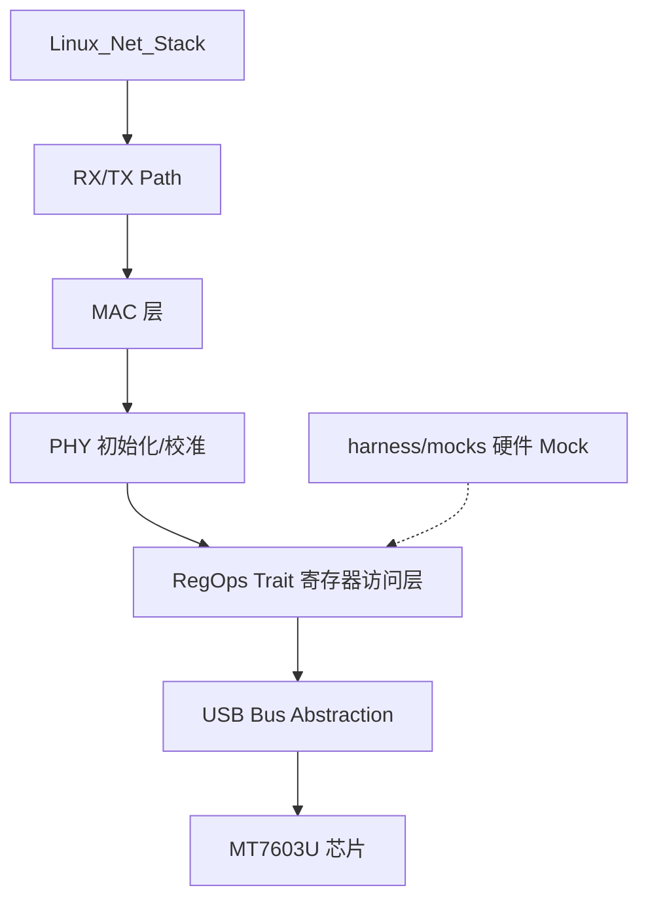

# System Design

## 1. High-Level Architecture
MT7603U 是 MediaTek 出品的 802.11n USB WiFi 芯片。本驱动以 Rust 编写，通过 USB 接口与芯片通信，内部以寄存器读写抽象层为核心。

## 2. Core Modules & Responsibilities
- **usb:** USB 设备枚举、端点管理（bulk/interrupt）。
- **regops:** 寄存器读写抽象（Trait + 具体实现），支持 I2C/MMIO/USB 后端。
- **mac:** MAC 层管理（BSSID、AID、Beacon、关联状态机）。
- **phy:** PHY 初始化、RF 校准序列、信道切换。
- **rx_tx:** 描述符队列、DMA 管理、802.11 帧收发路径。

## 3. Data Flow
[关键业务流程的数据流转顺序说明 — 待补：加电初始化序列、TX 帧下发、RX 帧回收与上报协议栈]
